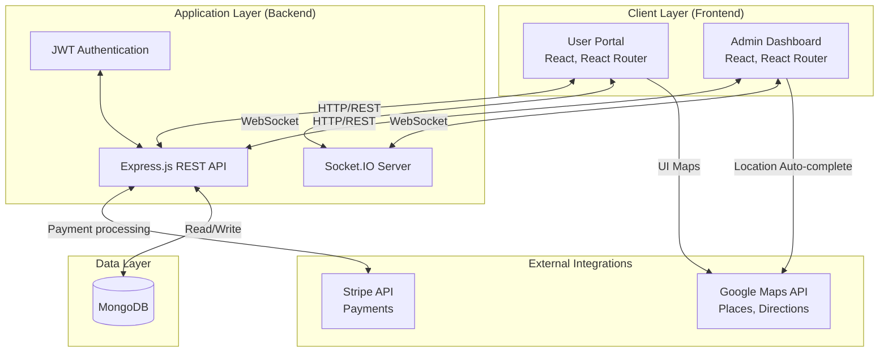
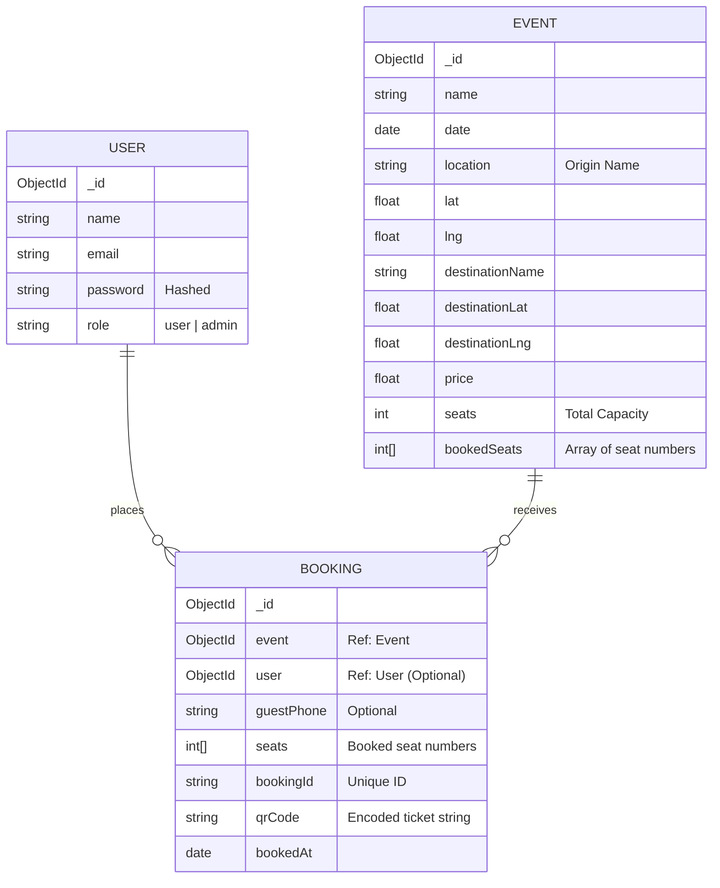
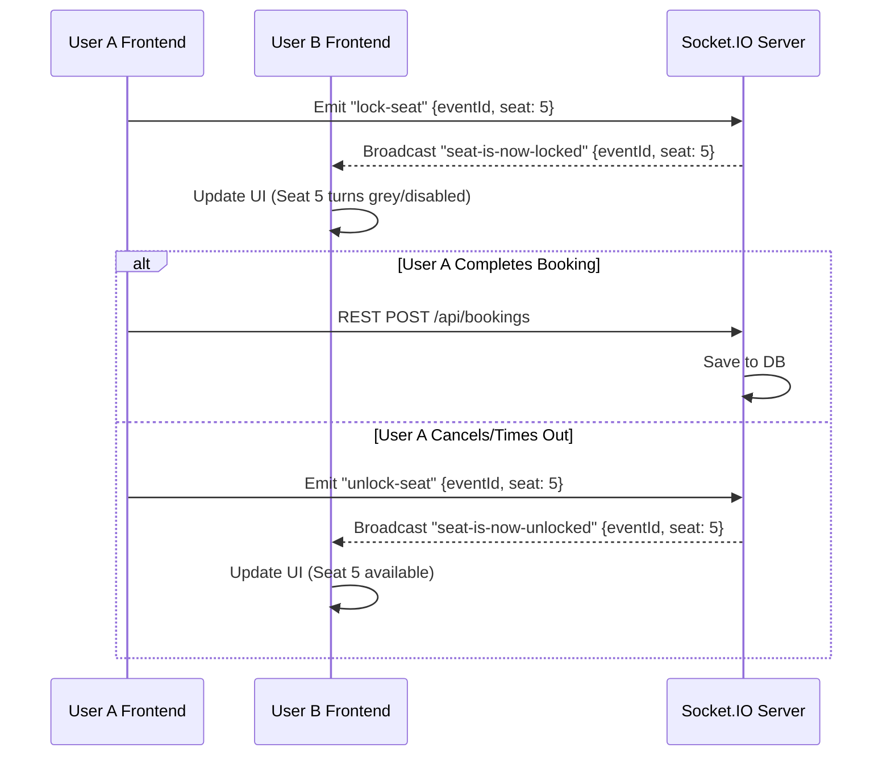
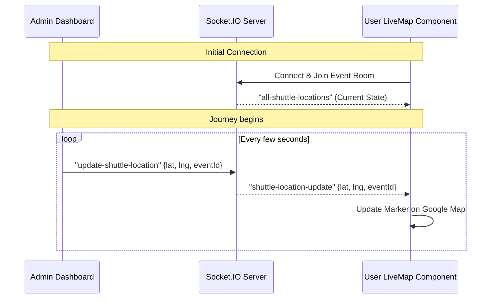

# ShuttleNow System Design Document

This document provides an in-depth system design for the ShuttleNow platform, detailing the architecture, data models, real-time communication flow, and API design.

## 1. High-Level Architecture

The system utilizes a 3-tier architecture (Client, Server, Database) augmented by WebSocket for real-time bidirectional communication.

## 2. API Design & Domain Boundaries

The backend API is RESTful and segmented by domain. Standard HTTP methods (GET, POST, PUT, DELETE) are used.

| Domain | Route Prefix | Responsibility | Key Endpoints |
| :--- | :--- | :--- | :--- |
| **Auth** | `/api/auth` | User & Admin Authentication | `POST /register`, `POST /login`, `GET /me` |
| **Events** | `/api/events` | Shuttle event listings | `GET /`, `GET /:id` |
| **Bookings**| `/api/bookings` | Booking execution & retrieval | `POST /`, `GET /user`, `GET /guest/:id` |
| **Admin** | `/api/admin` | Dashboard & event management (Protected) | `POST /events`, `PUT /events/:id`, `GET /stats` |

## 3. Database Schema Design (Entity-Relationship)

The database is built on MongoDB using Mongoose, prioritizing read-heavy operations for events while maintaining relationship references for bookings.

## 4. Real-Time System Workflows

The platform heavily relies on real-time capabilities for two main features: **Seat Soft Locking** and **Live Tracking**.

### 4.1. Real-Time Seat 'Soft Locking'

To prevent double bookings, when a user clicks a seat, it is immediately locked for others before the payment is even processed.

### 4.2. Live Shuttle Tracking

Admins broadcast the location of the shuttle, which updates seamlessly on the user's Google Maps component.

## 5. Security & Authentication Design

- **Authentication Mechanism**: JWT (JSON Web Tokens). Issued upon successful login via `/api/auth/login`.
- **Token Storage**: Stored securely on the client side (typically in `localStorage` or `sessionStorage` in this MERN stack implementation) and sent via the `Authorization: Bearer <token>` header on protected routes.
- **Authorization**: Endpoints targeting `/api/admin/*` undergo middleware checks validating the JWT payload's `role` property to ensure it equals the administrator role.
- **Passwords**: Hashed with `bcryptjs` using a strong salt round before persisting to MongoDB.

## 6. Request/Data Flow: Booking a Shuttle

1. **Discovery:** User hits the Frontend `MainPage` -> GET `/api` (Fetches upcoming `Event` objects).
2. **Selection:** User clicks an event, navigates to seat selection -> Connects to Socket.IO.
3. **Locking:** User clicks Seat #4 -> UI emits `lock-seat` socket event.
4. **Checkout:** User submits details (or logs in) and confirms payment flow (via Stripe).
5. **Confirmation:**
   - Frontend triggers POST `/api/bookings` with `eventId`, `seats: [4]`, payment intent.
   - Backend validates seats are still available in the database.
   - Backend generates a unique `bookingId` and a Base64 `qrCode`.
   - Backend updates `Event.bookedSeats` array.
   - Backend creates `Booking` document.
   - Returns successful status + booking data.
6. **Success UI:** Frontend routes to `BookingSuccessPage` and displays the QR code ticket.
